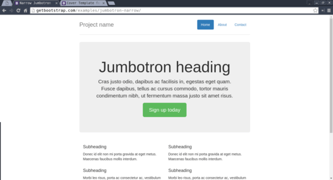
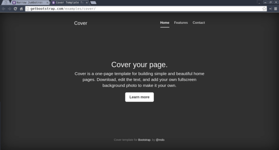

# Using jQuery and Bootstrap

## Objectives

Mari kita mencoba-coba dan bereksplorasi dalam penggunaan frontend libary dan framework.

- ▢ Memahami library dan framework
- ▢ Memasang library jQuery dan Bootstrap pada project
- ▢ Menggunakan sintaks jQuery untuk menggantikan sintaks JavaScript standar
- ▢ Menggunakan komponen Bootstrap yang sudah siap pakai
- ▢ Berlatih membaca dokumentasi dari sebuah tool, libray, framework, atau aplikasi.

## Directions

### Mencoba jQuery

(1) [Download jQuery versi 2](https://jquery.com/download), yang siap pakai yaitu ["Download the compressed, production jQuery 2.2.4"](https://code.jquery.com/jquery-2.2.4.min.js). Tempatkan di folder yang sama dengan file HTML kita (`belajar-jquery.html` misalnya).

(2) Siapkan file HTML kita untuk berisi berbagai macam element.

(3) Pada `script` dalam file HTML tersebut, cobalah untuk mendapatkan berbagai element yang ada, dengan sintaks `$();`.

(4) Gunakan method-method yang dapat menggantikan API JavaScript standard seperti:

- selector id ("#id-name") dan class (".class-name"); menggantikan `.getElemenyById` dan `.getElementsByClassName`
- event handler `change()`, `click()`, `hover()`; menggantikan `addEventListener()`
- dan berbagai lainnya seperti yang dijabarkan dalam [dokumentasi jQuery API](https://api.jquery.com).

(Opsional) Bonus:

- Belajar lebih banyak melalui halaman [jQuery Learning Center](http://learn.jquery.com).
- Selesaikan berbagai latihan yang ada di [jQuery Course oleh Codecademy](https://www.codecademy.com/learn/jquery)

### Mencoba Bootstrap

(1) Setelah mengetahui [apa itu Bootstrap terutama melalui dokumentasinya](http://getbootstrap.com), mari kita gunakan.

(2) [Download Bootstrap](http://getbootstrap.com/getting-started/#download), [versi terakhir](https://github.com/twbs/bootstrap/releases/download/v3.3.6/bootstrap-3.3.6-dist.zip). Akan di-download sebuah zip yang kemudian perlu anda ekstrak ke dalam folder yang sama dengan file HTML kita (`belajar-bootstrap.html` misalnya).

(3) Akan terdapat folder dengan struktur berikut:

```
bootstrap/
├── css/
│   ├── bootstrap.css
│   ├── bootstrap.css.map
│   ├── bootstrap.min.css
│   ├── bootstrap.min.css.map
│   ├── bootstrap-theme.css
│   ├── bootstrap-theme.css.map
│   ├── bootstrap-theme.min.css
│   └── bootstrap-theme.min.css.map
├── js/
└── fonts/
```

(4) Pindahkan file `bootstrap.min.css` dan `bootstrap-theme.min.css` ke bagian root dari project kita.

(5) Panggil kedua file tersebut dengan tag `<link rel="stylesheet>`

(6) Cobalah untuk mengambil [berbagai contoh/examples yang tersedia](http://getbootstrap.com/getting-started/#examples) pada dokumentasi tersebut. Misalnya "Narrow Jumbotron" atau "Cover".




(7) Ubahlah konten dan style template tersebut sesuka hati. [Silakan baca dokumentasi CSS-nya](http://getbootstrap.com/css) untuk lebih tahu apa saja yang dapat kita gunakan.

(8) Selamat! Kamu jadi punya bantuan untuk membuat website dengan singkat namun dengan layout yang bagus. Terima kasih Bootstrap!
